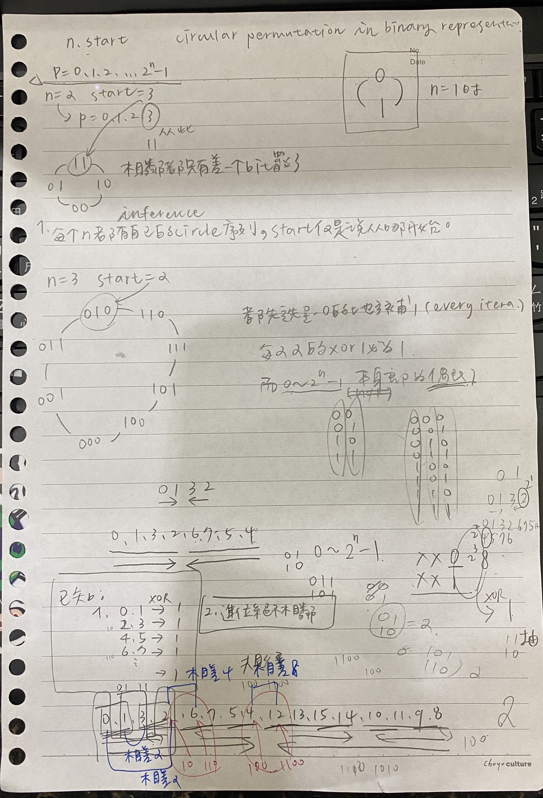

Given 2 integers n and start. Your task is return any permutation p of (0,1,2.....,2^n -1) such that :

* p[0] = start
* p[i] and p[i+1] differ by only one bit in their binary representation.
* p[0] and p[2^n -1] must also differ by only one bit in their binary representation.
 

## Example 1:

	Input: n = 2, start = 3
	Output: [3,2,0,1]
	Explanation: The binary representation of the permutation is (11,10,00,01). 
	All the adjacent element differ by one bit. Another valid permutation is [3,1,0,2]
## Example 2:

	Input: n = 3, start = 2
	Output: [2,6,7,5,4,0,1,3]
	Explanation: The binary representation of the permutation is (010,110,111,101,100,000,001,011).
 

## Constraints:

* 1 <= n <= 16
* 0 <= start < 2 ^ n

## [原題目連結點我](https://leetcode.com/problems/circular-permutation-in-binary-representation/)
	
## 我的心得:
* main.py
* 思路:


* 序列都有所規律
	1. [0,1]
	2. [0,1,3,2]
	3. [0,1,3,2,6,7,5,4]
	...
* 我是找出序列的規律，然後製成 list，最後再取用 start 之後及之前的片段
* 我本來有想是否能用 xor 的方式完成，但我只有想到 `0 ^ 1 = 1`, '2 ^ 3 = 1'... 每兩兩(必須由偶數起始)的 XOR 會是 1(因為只有 LSB 有差)
* 也有發現 0 ~ 2^n - 1 中，除了 n == 1，其他的 n 都會讓序列中全部 XOR 為 0
* 不知道這個性質是否能應用呢?
* 總而言之，我的作法是一開始 n == 1 時，序列為 [0,1]
* n == 2:  [0,1,**3,2**]，後面那個`3, 2`其實是從 `2, 3`變來的，也就是說在每一個 iteration 中，要找出該 iteration 的起始，也就是這行 
```python
	next_start = 2 ** m 
```
* 然後原序列加上這個 next_start，之後再反轉，就可以得到下一次新的序列
* 像是鏡子一樣，但是能不斷地反射出新的序列

-----
* 看到討論區的一個寫法真的是太厲害了，茲紀錄:
```python
n = 3
for i in range(1 << n):
    print(bin(i^(i>>1)))
```
* 上面的可以產生下面的序列:(即為 **gray code**)
```python
0b0
0b1
0b11
0b10
0b110
0b111
0b101
0b100
```
* 那麼如果要設起點(start)，用這個想法→我們知道現在上面產生的序列，每兩兩都是差 1 個 bit，就算再多 XOR 一個 constant 也不會打破 "兩兩差 1 bit" 的這個性質
* 比如說，`0b111`和`0b101`，同時再 XOR 2 的話，就會變成`0b101`和`0b111`，發現這樣的結果仍然是兩個彼此差 1 bit
* 因為我們的`i^(i>>1)`的`i`是從 0 開始，而`0 ^ (0>>1)`等同於`0 ^ (0)`也等同於`0`，故一開始就給予`start^i^(i>>1)`是合理的，並且會使所有的序列從 start 作為開頭，彼此兩兩都會差 1 bit
* 故實做 code 如下:
```python
	def circularPermutation(self, n, start):
		return [start ^ i ^ i >> 1 for i in range(1 << n)]
```
