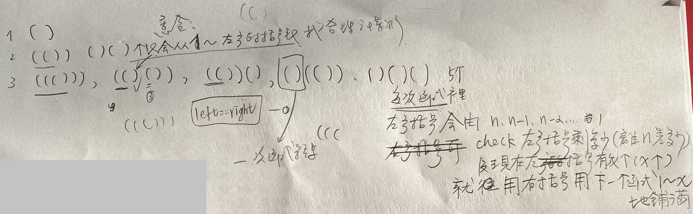

Given n pairs of parentheses, write a function to generate all combinations of well-formed parentheses.

 

## Example 1:

	Input: n = 3
	Output: ["((()))","(()())","(())()","()(())","()()()"]

## Example 2:

	Input: n = 1
	Output: ["()"]
 

## Constraints:

* 1 <= n <= 8

## [原題目連結點我](https://leetcode.com/problems/generate-parentheses/)

## 我的心得:
* main.py
* 
* 就是現在緊盯左邊還剩下幾個沒有搭配過的`"("`，思路如上
* 因為看測資的結果發現他放 ret list 的答案是有順序及規律的，所以就只要找出這樣的規律即可