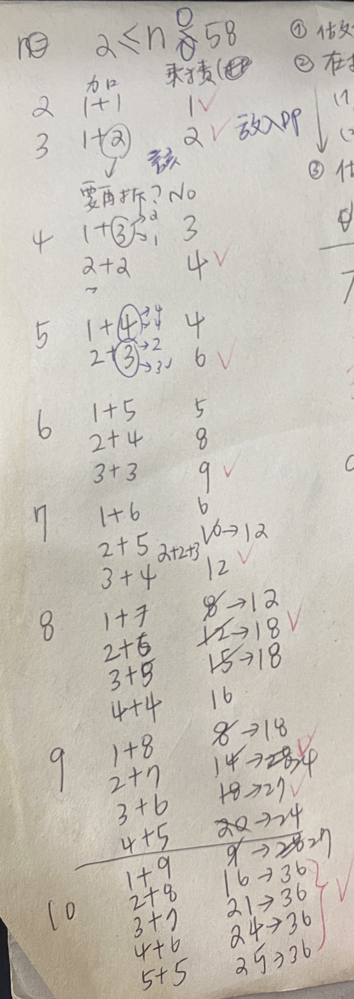

Given a positive integer n, break it into the sum of at least two positive integers and maximize the product of those integers. Return the maximum product you can get.

## Example 1:

* Input: 2
* Output: 1
* Explanation: 2 = 1 + 1, 1 × 1 = 1.
## Example 2:

* Input: 10
* Output: 36
* Explanation: 10 = 3 + 3 + 4, 3 × 3 × 4 = 36.
* Note: You may assume that n is not less than 2 and not larger than 58.

## [原題目連結點我](https://leetcode.com/problems/integer-break/)
	
## 我的心得:
* 這題會使用到 dp，就不用重複拆解及計算
* implement 以下思考過程:




* 參考上圖，要注意的是 dp (對應 index )裡面放的值，以 4 拆解為例:
要做 4 的時候， dp 應為 [0,0,1,2] ( index 記錄到 3 )  
4 拆解為:  
(1) 1 + 3   
其值為 取最大(1 or dp[1]) * 取最大(3 or dp[3])，並且跟上一次乘積進行比較  
(2) 2 + 2  
其值為 取最大(2 or dp[2]) * 取最大(2 or dp[2])，並且跟上一次乘積進行比較  
* 因為在拆解的時候， dp 該 index 存的不一定是最大值，可能是該 index 本身會是最大的，所以需要特別考量

* 然後一路把表建完，最後 return 回去 dp 的 index 位置即可

* 所建的 dp 表( 到 58 )如下:

		[0, 0, 1, 2, 4, 6, 9, 12, 18, 27, 36, 54, 81, 108, 162, 243, 324, 486, 729, 972, 1458, 2187, 2916, 4374, 6561, 8748, 13122, 19683, 26244, 39366, 59049, 78732, 118098, 177147, 236196, 354294, 531441, 708588, 1062882, 1594323, 2125764, 3188646, 4782969, 6377292, 9565938, 14348907, 19131876, 28697814, 43046721, 57395628, 86093442, 129140163, 172186884, 258280326, 387420489, 516560652, 774840978, 1162261467, 1549681956]


 
 ----

* 我看到這個解法多了一層思考，覺得不錯，特此紀錄:
Given a number n lets say we have a possible product P = p1 * p2 * ... pk. Then we notice what would happen if we could break pi up into two more terms lets say one of the terms is 2 we would get the terms pi-2 and 2 so if 2(pi-2) > pi we would get a bigger product and this happens if pi > 4.  

since there is one other possible number less then 4 that is not 2 aka 3. 
Likewise for 3 if we instead breakup the one of the terms into pi-3 and 3 we would get a bigger product if 3*(pi-3) > pi which happens if pi > 4.5.  

Hence we see that all of the terms in the product must be 2's and 3's. So we now just need to write n = a3 + b2 such that P = (3^a) * (2^b) is maximized.   
Hence we should favor more 3's then 2's in the product then 2's if possible.  

So if n = a*3 then the answer will just be 3^a.  

if n = a3 + 2 then the answer will be 2(3^a).  

and if n = a3 + 22 then the answer will be 2 * 2 * 3^a  

The above three cover all cases that n can be written as and the Math.pow() function takes O(log n) time to preform hence that is the running time.  

```python
public class Solution {
    public int integerBreak(int n) {
	if(n == 2)
	    return 1;
	else if(n == 3)
	    return 2;
	else if(n%3 == 0)
	    return (int)Math.pow(3, n/3);
	else if(n%3 == 1)
	    return 2 * 2 * (int) Math.pow(3, (n - 4) / 3);
	else 
	    return 2 * (int) Math.pow(3, n/3);
    }

}
```
