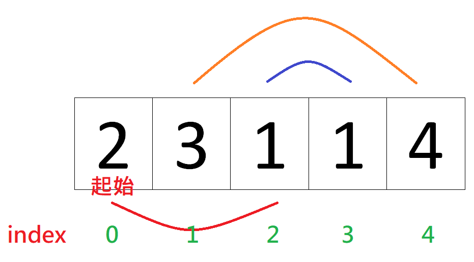

Given an array of non-negative integers, you are initially positioned at the first index of the array.

* Each element in the array represents your maximum jump length at that position.

* Your goal is to reach the last index in the minimum number of jumps.

## Example:

* Input: [2,3,1,1,4]
* Output: 2
* Explanation: The minimum number of jumps to reach the last index is 2.
* Jump 1 step from index 0 to 1, then 3 steps to the last index.
## Note:

* You can assume that you can always reach the last index.

## [原題目連結點我](https://leetcode.com/problems/jump-game-ii/)
	
## 我的心得:
* 使用 greedy
* 如下圖所示:  

  

* 題目的 index 0 不可能值為 0，因為無法用 return 值表示最終要花多少步走到終點(要 9999999? inf? 實際上也不可能走上終點)，所以不需要考慮這種情況
* 每次都會有一個可以走的區間，定義為 left 和 right( right 紀錄為該次 iteration 最大可以走到之處)，這是用來標記 index 範圍
* 要選的點會是該點再走下一步亦能走最大的 range 的
* 以 local suboptimal 推成 global optimal!
* 所能走的範圍計算方式為: 該點的 index + 該 index 所存之值