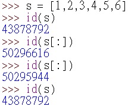
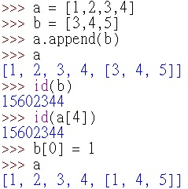

Given a string s, partition s such that every substring of the partition is a palindrome.

* Return all possible palindrome partitioning of s.

## Example:

* Input: "aab"
* Output:  
[  
  ["aa","b"],  
  ["a","a","b"]  
]  

## [原題目連結點我](https://leetcode.com/problems/palindrome-partitioning/)
	
## 我的心得:
* 思路如下：

----

* main2.py  
* 終於發現問題所在，也學習到 [:] 的意涵
* 在 return a_list 後面加上 [:] 是非常必要的事情(詳見上面的圖片)
* 此為 pass by reference 和 pass by value 的 issue
* slicing 詳細用法請見此[連接](https://stackoverflow.com/questions/509211/understanding-slice-notation)  
* 實際做實驗發現:  
	  
	每次使用 s 的 address 都是相同的  
	而使用 s[:] 每次都會不相同，原因是它只是個 copy  
* 而使用 copy 可以確定一 recursive 的結果不會隨著外部變動而改變
* 簡言之，可以把 main1.py 中所寫的 a_list 當成只有一份，所以 a_list 在改動的時候，連帶也會影響已經 append 入 ret 的值
* 於是我又再做了這個實驗:  
	  
	發現 append 進去的確實會因為原來的東西改變而使得被塞入的也一起改變，仔細觀察實驗結果，b 及 a[4] 的 address 都是相同的  

