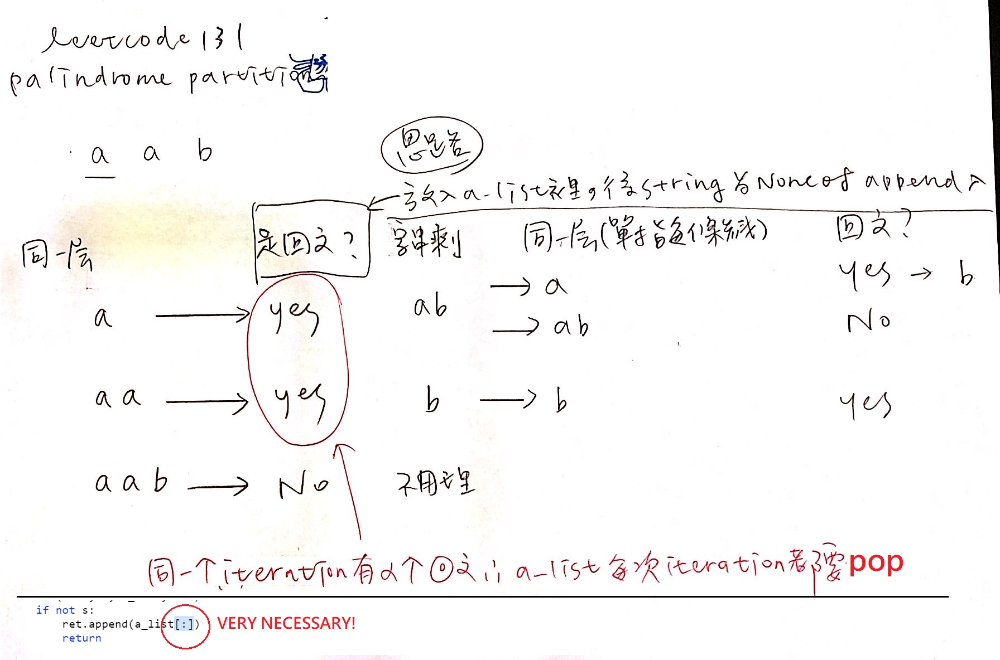

Given a string s, partition s such that every substring of the partition is a palindrome.

* Return all possible palindrome partitioning of s.

## Example:

* Input: "aab"
* Output:
[  
  ["aa","b"],  
  ["a","a","b"]  
]  

## [原題目連結點我](https://leetcode.com/problems/palindrome-partitioning/)
	
## 我的心得:
* 思路如下：

