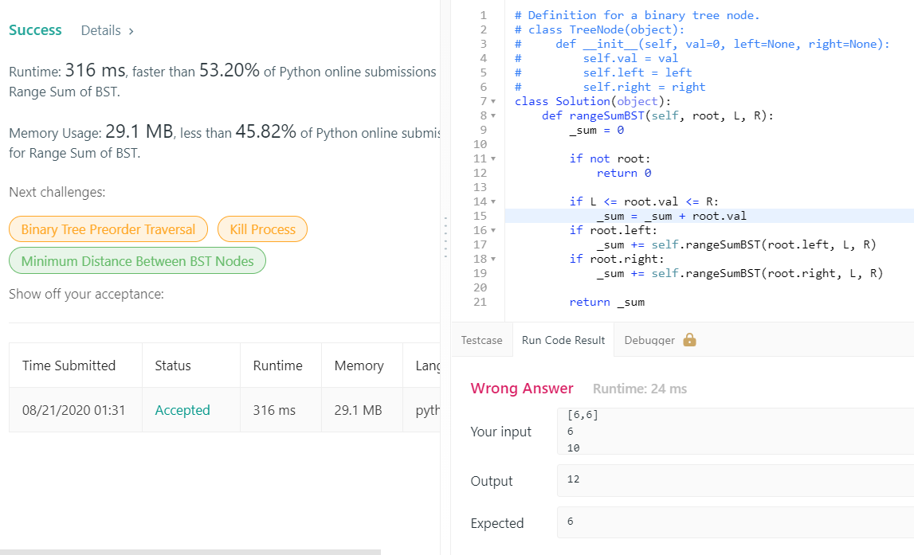

Given the root node of a binary search tree, return the sum of values of all nodes with value between L and R (inclusive).

* The binary search tree is guaranteed to have unique values.

 

## Example 1:

* Input: root = [10,5,15,3,7,null,18], L = 7, R = 15
* Output: 32
## Example 2:

* Input: root = [10,5,15,3,7,13,18,1,null,6], L = 6, R = 10
* Output: 23
 

## Note:

* The number of nodes in the tree is at most 10000.
* The final answer is guaranteed to be less than 2^31.

## [原題目連結點我](https://leetcode.com/problems/range-sum-of-bst/)
	
## 我的心得:
* main.py 
* 想清楚遞迴結構就好
* 但我覺得這題 leetcode 在 run code 給的答案會是錯的(但 commit 會是對的)
* 如下圖:  

