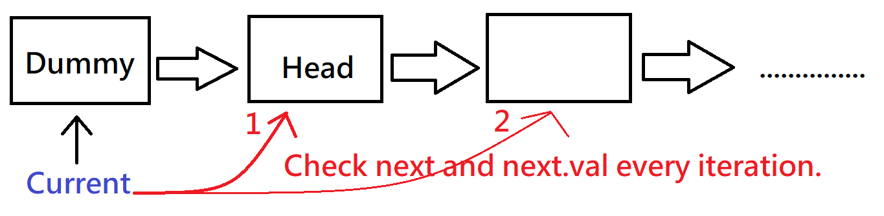

Remove all elements from a linked list of integers that have value val.

## Example:

* Input:  1->2->6->3->4->5->6, val = 6
* Output: 1->2->3->4->5

## [原題目連結點我](https://leetcode.com/problems/remove-linked-list-elements/)
	
## 我的心得:
* 