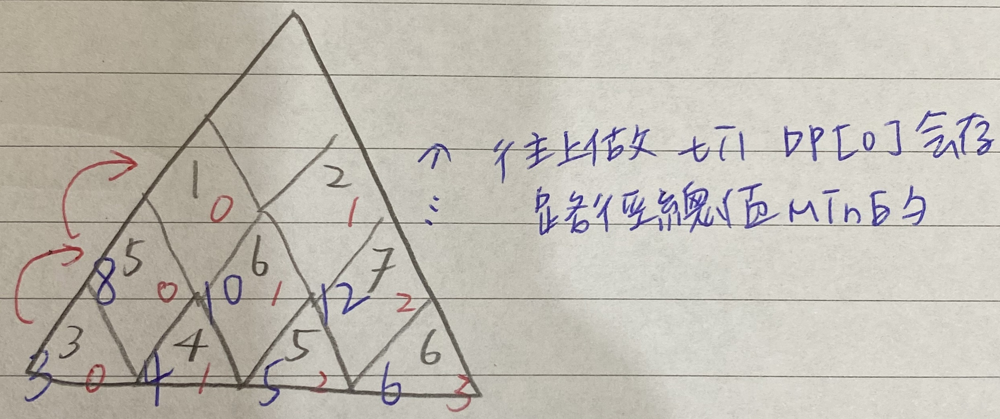

Given a triangle, find the minimum path sum from top to bottom. Each step you may move to adjacent numbers on the row below.

* For example, given the following triangle

[  
　　　　[2],  
　　 　[3,4],  
　　　[6,5,7],  
　 　[4,1,8,3]  
]  
* The minimum path sum from top to bottom is 11 (i.e., 2 + 3 + 5 + 1 = 11).

## Note:

* Bonus point if you are able to do this using only O(n) extra space, where n is the total number of rows in the triangle.

## [原題目連結點我](https://leetcode.com/problems/triangle/)
	
## 我的心得:
* 這題要使用 DP

* 
* 思考如上，由最下層做到最上層，曾經算過的就記錄在 DP 裡，就不需重複計算，而可以快速有效率知道"上面一層要到底"當下的總和為何
* 紅筆是該層 DP 的 index，藍筆是說含下面的正三角形的最短路徑值