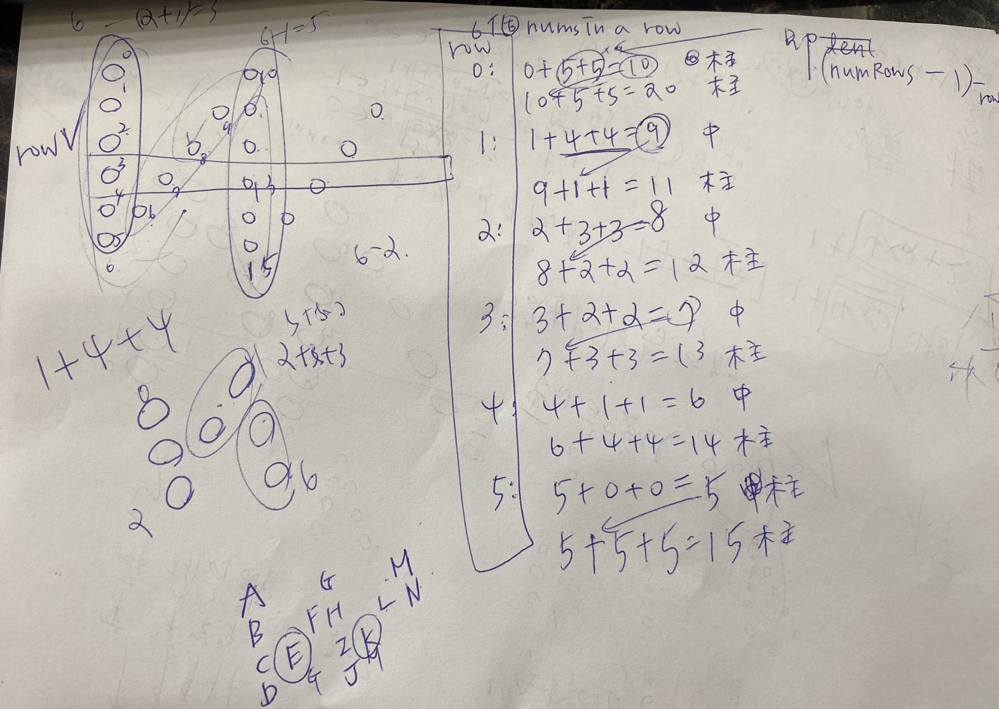

* The string "PAYPALISHIRING" is written in a zigzag pattern on a given number of rows like this: (you may want to display this pattern in a fixed font for better legibility)

	P   A   H   N
	A P L S I I G
	Y   I   R
	
* And then read line by line: "PAHNAPLSIIGYIR"

* Write the code that will take a string and make this conversion given a number of rows:

* string convert(string s, int numRows);
## Example 1:

* Input: s = "PAYPALISHIRING", numRows = 3
* Output: "PAHNAPLSIIGYIR"
## Example 2:

* Input: s = "PAYPALISHIRING", numRows = 4
* Output: "PINALSIGYAHRPI"
* Explanation:

	P     I    N
	A   L S  I G
	Y A   H R
	P     I

## 我的心得:

* 這題要想清楚 row 的頭、尾和中間
* row 中間的部分要分成 zigzag 中間斜的部分(我在程式碼註解中稱之為中間)以及直行的部分(我在程式碼註解中稱之為柱)
* flag 是用來判斷現在是做直行還是中間，每次換行做的時候務必 reset flag